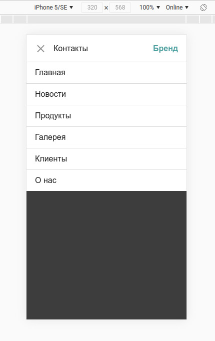

# menu-compojs



An illustrative **[example](http://compojs.ru/example)** of creating a Menu component in **[Compo.js](http://compojs.ru/)**, with a detailed description in the comments.

## Install

```
npm i menu-compojs
```

## Using

**index.html**

```html
<!DOCTYPE html>
<html lang="ru">
<head>
  <meta charset="UTF-8">
  <meta name="viewport" content="width=device-width, initial-scale=1.0">
  <title>Меню</title>
  <link rel="stylesheet" href="https://cdnjs.cloudflare.com/ajax/libs/normalize/8.0.1/normalize.min.css">
  <style>
    /* добавить стили тегу 'body', чтобы продемонстрировать
      работу компонента 'c-menu' в окне браузера */
    body {
      min-height: 1000px;
      background: #ccc;
    }
  </style>
</head>
<body>
  <!-- монтировать компонент 'c-menu' в тег 'nav' и добавить этому тегу атрибут 'hidden',
    чтобы нестилизованные элементы компонента не отображались, пока компонент не будет полностью готов -->
  <nav is="c-menu" hidden>
    <!-- импортировать Логотип в компонент 'c-menu', через именованный слот 'logo' -->
    <a href="/" slot="logo">Бренд</a>

    <!-- импортировать пункты Меню в компонент 'c-menu', через именованный слот 'item' -->
    <a href="/" slot="item">Главная</a>
    <a href="#news" slot="item">Новости</a>
    <a href="#products" slot="item">Продукты</a>
    <a href="#gallery" slot="item">Галерея</a>
    <a href="#clients" slot="item">Клиенты</a>
    <a href="#about" slot="item">О нас</a>
    <a href="#contacts" slot="item">Контакты</a>
  </nav>

  <!-- подключить файл компонентов -->
  <template src="dist/components.htm"></template>

  <!-- подключить Compo.js -->
  <script src="dist/compo.min.js"></script>
</body>
</html>
```
<br>

**menu.htm**

```html
<c-menu to="nav">
  <!-- HTML-содержимое компонента -->
  <div class="wrapper">
    <div class="head">
      <button class="button"></button>
      <a href="#" class="page"></a>
      <!-- в этот слот будет монтироваться Логотип -->
      <slot name="logo"></slot>
    </div>
    <div class="list">
      <!-- в этот слот будут монтироваться пункты Меню -->
      <slot name="item"></slot>
    </div>
  </div>


  <!-- Стили компонента -->
  <style>
    /* CSS-переменные компонента, значения которым можно задать
      через атрибуты data-* его тега монтирования, например:

      <nav is="c-menu" hidden
        data-height-menu="70px"
        data-font-size="1.5em"
        data-opacity=".9"
        data-duration="600ms"
      >
        <!-- импортировать Логотип в компонент 'c-menu', через именованный слот 'logo' -->
        <a href="/#" slot="logo">Бренд</a>
        ...
      </nav>

      Если атрибуты data-* не используются, то этим переменным устанавливаются значения по умолчанию.
      В примере ниже, значением по умолчанию для перепенной --height-menu будет '55px'

      --height-menu: ${ this.dataset.heightMenu || '55px' };
    */
    :host {
      --height-menu: ${ this.dataset.heightMenu || '55px' };
      --font-size: ${ this.dataset.fontSize || '1em' };
      --main-color: ${ this.dataset.mainColor || '#222' };
      --second-color: ${ this.dataset.secondColor || 'cadetblue' };
      --background-color: ${ this.dataset.backgroundColor || '#fff' };
      --border-color: ${ this.dataset.borderColor || '#ddd' };
      --border-width: ${ this.dataset.borderWidth || '1px' };
      --opacity: ${ this.dataset.opacity || '.5' };
      --duration: ${ this.dataset.duration || '200ms' };
      --small: ${ small };
      --medium: ${ medium };
      --large: ${ large };
    }

    /* Общие стили для всех элементов компонента, кроме находящихся в слотах */
    * {
      box-sizing: border-box;
      -webkit-tap-highlight-color: rgba(0, 0, 0, 0);
    }

    /* Стили для элемента-хозяина (тег монтирования) компонента  */
    :host {
      position: fixed;
      z-index: 10000;
      width: 100%;
      top: 0;
      height: var(--height-menu);
      overflow: hidden;
      font-family: sans-serif;
      border-bottom: var(--border-width) solid var(--border-color);
      background: rgba(0,0,0,.7);
      transition: height var(--duration);
    }
    :host(.host--open) {
      height: 100%;
      border-bottom: none;
    }

    /* Стили для ссылки Логотипа из светлого DOM, передаваемой в слот с именем 'logo' компонента.
      Подробнее: https://learn.javascript.ru/shadow-dom-style#primenenie-stiley-k-soderzhimomu-slotov
    */
    ::slotted(a[slot="logo"]) {
      margin-right: 14px;
      padding: 3px;
      font-weight: 600;
      font-size: var(--font-size);
      text-decoration: none;
      color: var(--second-color);
    }

    /* Стили для ссылок Меню из светлого DOM, передаваемых в слот с именем 'item' компонента.
      Подробнее: https://learn.javascript.ru/shadow-dom-style#primenenie-stiley-k-soderzhimomu-slotov  
    */
    ::slotted(a[slot="item"]) {
      display: block;
      padding: 12px 17px;
      font-size: var(--font-size);
      text-decoration: none;
      color: var(--main-color);
      border-top: var(--border-width) solid var(--border-color);
      background-color: var(--background-color) !important;
    }
    ::slotted(a[slot="item"]:hover) {
      color: #fff;
      background: var(--main-color) !important;
    }
    ::slotted(a[slot="item"].item--hide) {
      display: none;
    }


    /* ------  Стили для остальных элементов компонента ------ */
    .wrapper {
      height: 100%;
    }

    .head {
      height: var(--height-menu);
      display: flex;
      align-items: center;
      background: var(--background-color);
    }

    .button {
      position: relative;
      width: 22px;
      height: 14px;
      margin-left: 17px;
      border: none;
      outline: none;
      cursor: pointer;
      background: transparent;
      border-top: 2px solid var(--main-color);
      border-bottom: 2px solid var(--main-color);
      transition: all var(--duration);
    }
    .button:hover {
      opacity: var(--opacity);
    }
    .button::before,
    .button::after {
      content: '';
      position: absolute;
      height: 2px;
      width: 100%;
      left: 0;
      top: 50%;
      margin-top: -1px;
      background: var(--main-color);
      transition: transform var(--duration);
    }
    .button--close {
      border-top-color: transparent;
      border-bottom-color: transparent;
    }
    .button--close::before,
    .button--close::after {
      width: calc(100% - 3px);
      left: 2px;
    }
    .button--close::before {
      transform: rotate(45deg);
    }
    .button--close::after {
      transform: rotate(-45deg);
    }

    .page {
      text-decoration: none;
      margin-left: 12px;
      margin-right: auto;
      padding: 3px;
      font-size: var(--font-size);
      color: var(--main-color);
      transition: opacity var(--duration);
    }
    .page:hover {
      opacity: var(--opacity);
    }

    .list {
      height: calc(100% - var(--height-menu) + var(--border-width));
      margin-top: calc(-1 * var(--border-width));
    }
    .list--overflow-auto {
      overflow-y: auto;
    }
    .list--overflow-hide {
      overflow: hidden;
    }


    /* Медиазапрос со стилями компонента. В медиазапросы нельзя передавать CSS-переменные, например:

      @media (min-width: var(--medium)) {
        ...
      }

      Этот код не сработает! Но можно использовать подстановки из Compo.js, что и показано ниже.
    */
    @media (min-width: ${ medium }) {
      :host {
        overflow: visible;
        background: var(--background-color);
      }
      :host(.host--open) {
        height: auto;
        border-bottom: var(--border-width) solid var(--border-color);
      }

      ::slotted(a[slot="logo"]) {
        margin-right: 0;
        margin-left: 14px;
      }

      ::slotted(a[slot="item"]) {
        display: inline;
        margin-right: 5px;
        padding: 5px 10px;
        border-top: none;
        background: none !important;
        transition: opacity var(--duration);
      }
      ::slotted(a[slot="item"]:last-of-type) {
        margin-right: 0;
      }
      ::slotted(a[slot="item"]:hover) {
        color: var(--main-color);
        opacity: var(--opacity);
        background: none !important;
      }
      ::slotted(a[slot="item"].item--hide) {
        display: inline-block;
      }
      ::slotted(a[slot="item"].item--active) {
        position: relative;
      }
      ::slotted(a[slot="item"].item--active)::after {
        content: '';
        position: absolute;
        left: 50%;
        bottom: 0;
        width: 40px;
        height: 1px;
        margin-left: -20px;
        background: var(--second-color);
      }

      .wrapper {
        display: flex;
        align-items: center;
        max-width: var(--medium);
        margin: 0 auto;
      }

      .head {
        margin-right: auto;
        background: none;
      }

      .button {
        display: none;
      }

      .page {
        display: none;
      }

      .list {
        display: inline;
        height: auto;
        margin-top: 0;
        margin-right: 7px;
      }
    }
  </style>


  <!-- Логика компонента -->
  <script>
    const host = this.$root.host
    const button = this.$('.button')
    const page = this.$('.page')
    const list = this.$('.list')
    const logo = this.$('slot[name="logo"]').assignedElements()[0]
    const links = this.$('slot[name="item"]').assignedElements()
    let isClick = false

    /* Определить пользовательские свойства компонента. Задать значения этим свойствам, вы можете из атрибутов
      data-* тега монтирования компонента, как и для CSS-переменных показанных выше. Если атрибуты data-* не используются,
      то свойствам устанавливаются значения по умолчанию. Например, свойству small устанавливается значение по умолчанию '600px'
    */
    this.small = this.dataset.small || '600px'
    this.medium = this.dataset.medium || '992px'
    this.large = this.dataset.large || '1200px'

    function pageSetting(target = location) {
      links.forEach(link => {
        if(link.href === target.href) {
          link.classList.add('item--hide')
          link.classList.add('item--active')
          page.textContent = link.textContent
          page.href = link.href
        }
        else {
          link.classList.remove('item--hide')
          link.classList.remove('item--active')
        }
      })
    }

    function toggleOverflow(toggle) {
      setTimeout(() => {
        list.classList[toggle]('list--overflow-auto')
        list.scrollTop = 0
        /* Чтобы получить доступ к CSS-переменным в JavaScript, используется метод getComputedStyle() объекта window.
          Подробнее: https://developer.mozilla.org/ru/docs/Web/API/Window/getComputedStyle
        */
      }, parseInt(window.getComputedStyle(host).getPropertyValue('--duration')))
    }

    function clickHandler(e) {
      isClick = true
      if(host.classList.contains('host--open')) button.click()
      pageSetting(e.target)
      setTimeout(() => isClick = false, 0)
    }
    
    pageSetting()
    
    button.addEventListener('click', () => {
      if(document.documentElement.clientWidth >= parseInt(this.medium)) return
      host.classList.toggle('host--open')

      if(host.classList.contains('host--open')) {
        button.classList.add('button--close')
        list.classList.remove('list--overflow-hide')
        toggleOverflow('add')
      }
      else {
        button.classList.remove('button--close')
        list.classList.add('list--overflow-hide')
        toggleOverflow('remove')
      }
    })

    page.addEventListener('click', clickHandler)
    logo.addEventListener('click', clickHandler)
    list.addEventListener('click', clickHandler)

    window.addEventListener('popstate', function() {
      if(isClick) return isClick = false
      if(host.classList.contains('host--open')) button.click()
      pageSetting()
    })

    window.addEventListener('keydown', function(e) {
      if(e.which == 27 && host.classList.contains('host--open')) button.click()
    })

    // Делаем тег монтирования компонента снова видимым
    this.$root.host.removeAttribute('hidden')
  </script>
</c-menu>
```

## Download

- **[menu.zip](http://compojs.ru/dist/files/menu.zip)**


## Author

- **[compojs.ru](http://www.compojs.ru)**

## Contacts

- **[https://vk.com/compojs](https://vk.com/compojs)**
- **[compo.js@mail.ru](mailto:compo.js@mail.ru)**
